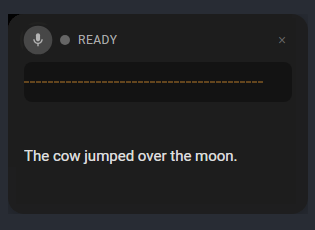

# Yammer

Local speech-to-text with LLM correction for Linux. Speak naturally, get polished text typed into any application.



## Features

- **Voice Activity Detection** - Automatically detects when you start/stop speaking
- **Speech-to-Text** - Local Whisper model for accurate transcription
- **LLM Text Correction** - Fixes homophones, adds punctuation, removes filler words
- **Floating Overlay** - Transparent window with real-time waveform visualization
- **Universal Input** - Types into any application via xdotool
- **100% Local** - No cloud services, all processing on-device
- **GPU Accelerated** - Optional CUDA support for faster transcription

## Requirements

- Linux with X11 (Wayland not yet supported)
- 4GB RAM minimum, 8GB recommended
- ~2GB disk for models

```bash
# Check your session type
echo $XDG_SESSION_TYPE  # Should output: x11
```

## Quick Start

### 1. Install Dependencies

```bash
# Ubuntu/Debian
sudo apt install clang libclang-dev libasound2-dev xdotool libayatana-appindicator3-dev nodejs npm

# Arch Linux
sudo pacman -S clang alsa-lib xdotool libayatana-appindicator nodejs npm

# Fedora
sudo dnf install clang clang-devel alsa-lib-devel xdotool libayatana-appindicator-gtk3-devel nodejs npm
```

### 2. Build

```bash
git clone https://github.com/andynu/yammer.git
cd yammer
cargo build --release
```

First build takes 10-15 minutes (compiles Whisper and llama.cpp).

### 3. Download Models

```bash
cargo run --release --bin yammer download-models
```

Downloads Whisper (~141MB) and TinyLlama (~1.6GB) to `~/.cache/yammer/models/`.

### 4. Run

```bash
# GUI mode
cd yammer-app && npm install && npm run tauri dev

# CLI mode (for testing)
cargo run --release --bin yammer dictate
```

## Usage

### GUI Mode

The floating overlay shows:
- Microphone status and state indicator
- Real-time waveform visualization
- Transcribed and corrected text

Press the global hotkey (configurable) to start/stop dictation. Text is automatically typed into the focused application.

### CLI Commands

```bash
# Live dictation
yammer dictate

# List audio devices
yammer list-devices

# Record audio
yammer record --duration 5 --output test.wav

# Transcribe a file
yammer transcribe test.wav

# Test voice activity detection
yammer vad-test --duration 30

# Correct text with LLM
yammer correct "your transcribed text here"
```

## Project Structure

```
yammer/
├── yammer-core/     # Shared types, config, model management
├── yammer-audio/    # Audio capture, VAD, resampling
├── yammer-stt/      # Whisper speech-to-text
├── yammer-llm/      # LLM text correction
├── yammer-output/   # Text output via xdotool
├── yammer-cli/      # CLI interface
└── yammer-app/      # Tauri desktop app
```

## Architecture

```
Microphone → Audio Capture → VAD → Resampler (16kHz)
                                       ↓
                                   Whisper → LLM Correction → xdotool → Active Window
                                       ↓
                               Tauri UI (waveform, status, text)
```

## Configuration

VAD sensitivity can be adjusted:

```bash
# More sensitive (quiet speech)
yammer dictate --threshold 0.005

# Less sensitive (loud/clear speech only)
yammer dictate --threshold 0.02
```

## Performance

| Component | CPU | GPU (CUDA) |
|-----------|-----|------------|
| Whisper (5s audio) | 500ms-1.5s | 250-750ms |
| LLM correction | 100-500ms | - |
| VAD latency | ~200ms start, ~400ms end | - |

## Troubleshooting

**Build fails with "stdbool.h not found"**
```bash
sudo apt install clang libclang-dev
```

**"No audio devices found"**
```bash
sudo apt install libasound2-dev
cargo clean && cargo build --release
```

**Window not transparent**
Requires X11 with a compositor (standard on GNOME/KDE).

**Transcription slow**
Use `--release` builds. Consider enabling CUDA if you have an NVIDIA GPU.

## Documentation

- [Audio Testing Guide](./AUDIO_TESTING.md)
- [UI Testing Guide](./yammer-app/TESTING.md)
- [Architecture & Onboarding](./docs/ONBOARDING.md)

## License

MIT - See [LICENSE](./LICENSE) and [THIRD_PARTY_NOTICES.md](./THIRD_PARTY_NOTICES.md) for details.

## Credits

- [whisper.cpp](https://github.com/ggerganov/whisper.cpp) - Speech recognition
- [llama.cpp](https://github.com/ggerganov/llama.cpp) - LLM inference
- [Tauri](https://tauri.app/) - Desktop app framework
- [cpal](https://github.com/RustAudio/cpal) - Audio I/O
